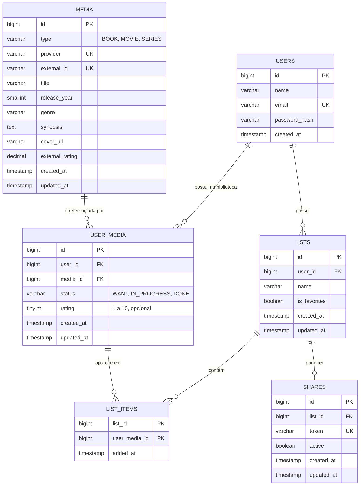

# 🧩 Personal Media Library — Modelo de Domínio e MER

> Baseado em `requisitos.md`. Este documento traduz as regras em entidades, tabelas, constraints e fluxos transacionais.
> Os pontos que estavam em aberto foram decididos e estão registrados na seção 8.

---

## 1. Visão geral do modelo

Três ideias sustentam o modelo:

1. **`Media` é dado de referência**, compartilhado entre usuários. Descreve a obra e não muda por causa de nenhum usuário.
2. **`UserMedia` é a relação do usuário com a obra.** É aqui que vivem `status` e `rating` (RN12, RN13).
3. **A lista é só organização.** A tabela `list_items` liga `UserMedia` às listas, sem duplicar nada.

---

## 2. Modelo de domínio

### 2.1 Entidades e responsabilidades

| Entidade | Papel | Comportamento no domínio |
|---|---|---|
| `User` | Dono de tudo o que é privado. | — |
| `Media` | Dados da obra (título, tipo, ano, capa, sinopse…). | Imutável do ponto de vista do usuário. |
| `UserMedia` | Mídia **na biblioteca** de um usuário, com status e nota. | `changeStatus()`, `rate()`, `isCompleted()`, `participatesInRanking()` |
| `MediaList` | Lista do usuário (inclui Favoritos). | `rename()`, `isFavorites()` |
| `ListItem` | Associação entre uma lista e um `UserMedia`. | — |
| `Share` | Compartilhamento público de uma lista. | `activate()`, `deactivate()` |

> Em Java, evite chamar a classe de `List` (conflita com `java.util.List`). Sugestão: `MediaList`.

### 2.2 Enums

```text
MediaType:           BOOK | MOVIE | SERIES
ConsumptionStatus:   WANT | IN_PROGRESS | DONE
```

Para preservar os nomes do requisito, o rótulo exibido depende do tipo:

| Status interno | Livro | Filme / Série |
|---|---|---|
| `WANT` | `QUERO_LER` | `QUERO_ASSISTIR` |
| `IN_PROGRESS` | `LENDO` | `ASSISTINDO` |
| `DONE` | `LIDO` | `ASSISTIDO` |

Vantagem: é **impossível** gravar um estado inválido para o tipo (ex.: `LIDO` num filme). A API pode devolver o status interno e o rótulo pronto.

### 2.3 Onde cada regra mora

Regras de **uma só entidade** ficam na própria entidade. Regras que envolvem **várias entidades** ficam em serviços de aplicação (`LibraryService`, `ListService`, `SharingService`).

| Regra | Onde é garantida |
|---|---|
| E-mail único (RN01) | Banco (`UNIQUE`) + serviço (mensagem clara) |
| Exatamente um Favoritos por usuário (RN03) | Banco (índice único via coluna gerada) + criação na transação do cadastro |
| Favoritos não pode ser excluído (RN04) | Serviço (`ListService`) |
| Favoritos não pode ser renomeado (RN25) | Serviço (`ListService`) |
| Nome de lista único por usuário (RN26) | Banco (`UNIQUE (user_id, name)`) + serviço (mensagem clara) |
| Excluir lista com mídias exclusivas exige confirmação (RN24) | Serviço + contrato da API |
| Um compartilhamento por lista (RN28) | Banco (`UNIQUE (list_id)` em `shares`) |
| Mídia + lista sem duplicidade (RN07) | Banco (PK composta de `list_items`) + serviço (informa "já está na lista") |
| Uma `UserMedia` por usuário e mídia | Banco (`UNIQUE (user_id, media_id)`) |
| Identidade da mídia (RN22) | Banco (`UNIQUE (provider, external_id)`) |
| Nota entre 1 e 10 (RN13) | Banco (`CHECK`) + entidade (`rate()`) |
| Só é possível **definir/alterar** nota com status `DONE` (RN13, RN14) | Entidade `UserMedia.rate()` |
| Nota **permanece** ao sair de `DONE` (RN15) | Modelo: `rating` é independente do `status` |
| Mídia sempre em ≥ 1 lista (RN05) | **Serviço, em transação com lock** (o banco não expressa isso) |
| Remover da última lista exige confirmação (RN08) | Serviço + contrato da API |
| Isolamento entre usuários (RF03, RNF02) | Serviço/repositório: toda consulta filtra pelo dono |
| Visitante só vê nome da lista e dados das mídias (RN21) | DTO público dedicado |

---

## 3. Diagrama entidade-relacionamento



**Cardinalidades:**
- Um usuário tem várias listas (uma delas é Favoritos) e várias mídias na biblioteca.
- `USER_MEDIA` é única por `(usuário, mídia)`.
- `LIST_ITEMS` implementa o N:N entre listas e `USER_MEDIA`.
- Uma lista tem **no máximo um** compartilhamento (interruptor ativo/inativo, conforme RF42 e RN28).

---

## 4. DDL (MySQL 8)

> Referência para a primeira migration (Flyway/Liquibase). Exige MySQL 8.0.16+ para que os `CHECK` sejam aplicados.

```sql
CREATE TABLE users (
    id            BIGINT       NOT NULL AUTO_INCREMENT,
    name          VARCHAR(100) NOT NULL,
    email         VARCHAR(255) NOT NULL,
    password_hash VARCHAR(255) NOT NULL,
    created_at    TIMESTAMP    NOT NULL DEFAULT CURRENT_TIMESTAMP,
    PRIMARY KEY (id),
    CONSTRAINT uq_users_email UNIQUE (email)
);

CREATE TABLE media (
    id              BIGINT        NOT NULL AUTO_INCREMENT,
    type            VARCHAR(10)   NOT NULL,
    provider        VARCHAR(30)   NOT NULL,
    external_id     VARCHAR(100)  NOT NULL,
    title           VARCHAR(500)  NOT NULL,
    release_year    SMALLINT      NULL,
    genre           VARCHAR(255)  NULL,
    synopsis        TEXT          NULL,
    cover_url       VARCHAR(1000) NULL,
    external_rating DECIMAL(3,1)  NULL,
    created_at      TIMESTAMP     NOT NULL DEFAULT CURRENT_TIMESTAMP,
    updated_at      TIMESTAMP     NOT NULL DEFAULT CURRENT_TIMESTAMP ON UPDATE CURRENT_TIMESTAMP,
    PRIMARY KEY (id),
    CONSTRAINT uq_media_provider_external UNIQUE (provider, external_id),
    CONSTRAINT ck_media_type CHECK (type IN ('BOOK', 'MOVIE', 'SERIES'))
);

CREATE TABLE lists (
    id                 BIGINT       NOT NULL AUTO_INCREMENT,
    user_id            BIGINT       NOT NULL,
    name               VARCHAR(100) NOT NULL,
    is_favorites       BOOLEAN      NOT NULL DEFAULT FALSE,
    -- Coluna gerada VIRTUAL (não STORED): só preenchida para a lista Favoritos.
    -- O índice único abaixo garante no máximo um Favoritos por usuário
    -- (o MySQL permite vários NULL em índice único).
    favorites_owner_id BIGINT GENERATED ALWAYS AS (CASE WHEN is_favorites THEN user_id ELSE NULL END) VIRTUAL,
    created_at         TIMESTAMP    NOT NULL DEFAULT CURRENT_TIMESTAMP,
    updated_at         TIMESTAMP    NOT NULL DEFAULT CURRENT_TIMESTAMP ON UPDATE CURRENT_TIMESTAMP,
    PRIMARY KEY (id),
    CONSTRAINT fk_lists_user FOREIGN KEY (user_id) REFERENCES users (id) ON DELETE CASCADE,
    CONSTRAINT uq_lists_one_favorites_per_user UNIQUE (favorites_owner_id),
    -- Nome único por usuário. Com a collation padrão do MySQL 8 (utf8mb4_0900_ai_ci)
    -- a comparação já ignora maiúsculas e acentos.
    CONSTRAINT uq_lists_user_name UNIQUE (user_id, name)
);
CREATE INDEX idx_lists_user ON lists (user_id);

CREATE TABLE user_media (
    id         BIGINT      NOT NULL AUTO_INCREMENT,
    user_id    BIGINT      NOT NULL,
    media_id   BIGINT      NOT NULL,
    status     VARCHAR(20) NOT NULL,
    rating     TINYINT     NULL,
    created_at TIMESTAMP   NOT NULL DEFAULT CURRENT_TIMESTAMP,
    updated_at TIMESTAMP   NOT NULL DEFAULT CURRENT_TIMESTAMP ON UPDATE CURRENT_TIMESTAMP,
    PRIMARY KEY (id),
    CONSTRAINT fk_user_media_user  FOREIGN KEY (user_id)  REFERENCES users (id) ON DELETE CASCADE,
    CONSTRAINT fk_user_media_media FOREIGN KEY (media_id) REFERENCES media (id) ON DELETE RESTRICT,
    CONSTRAINT uq_user_media UNIQUE (user_id, media_id),
    CONSTRAINT ck_user_media_status CHECK (status IN ('WANT', 'IN_PROGRESS', 'DONE')),
    CONSTRAINT ck_user_media_rating CHECK (rating IS NULL OR rating BETWEEN 1 AND 10)
);

CREATE TABLE list_items (
    list_id       BIGINT    NOT NULL,
    user_media_id BIGINT    NOT NULL,
    added_at      TIMESTAMP NOT NULL DEFAULT CURRENT_TIMESTAMP,
    PRIMARY KEY (list_id, user_media_id),   -- impede a mesma mídia duas vezes na mesma lista
    CONSTRAINT fk_list_items_list       FOREIGN KEY (list_id)       REFERENCES lists (id)      ON DELETE CASCADE,
    CONSTRAINT fk_list_items_user_media FOREIGN KEY (user_media_id) REFERENCES user_media (id) ON DELETE CASCADE
);
CREATE INDEX idx_list_items_user_media ON list_items (user_media_id);

CREATE TABLE shares (
    id         BIGINT      NOT NULL AUTO_INCREMENT,
    list_id    BIGINT      NOT NULL,
    token      VARCHAR(64) NOT NULL,
    active     BOOLEAN     NOT NULL DEFAULT TRUE,
    created_at TIMESTAMP   NOT NULL DEFAULT CURRENT_TIMESTAMP,
    updated_at TIMESTAMP   NOT NULL DEFAULT CURRENT_TIMESTAMP ON UPDATE CURRENT_TIMESTAMP,
    PRIMARY KEY (id),
    CONSTRAINT fk_shares_list FOREIGN KEY (list_id) REFERENCES lists (id) ON DELETE CASCADE,
    CONSTRAINT uq_shares_list  UNIQUE (list_id),
    CONSTRAINT uq_shares_token UNIQUE (token)
);
```

### Notas sobre o DDL

- **Nota × status:** o banco **não** exige `status = 'DONE'` para existir uma nota, porque a nota deve permanecer quando o status muda (RN15). A regra "só define/altera nota se estiver concluída" fica na entidade.
- **Mesmo dono em `list_items`:** o banco não impede ligar uma lista de um usuário à `UserMedia` de outro. O serviço garante isso ao carregar ambos filtrando pelo dono. Se quiser proteção extra no banco, dá para usar chaves compostas `(id, user_id)`, ao custo de mapeamento JPA mais trabalhoso.
- **E-mail:** normalizar (minúsculas, sem espaços) antes de gravar, para que `A@x.com` e `a@x.com` não sejam contas diferentes.
- **Coluna gerada `VIRTUAL`, não `STORED`:** o MySQL recusa (erro 1215) criar uma chave estrangeira com `ON DELETE CASCADE` sobre a coluna-base de uma coluna gerada `STORED`. Com `VIRTUAL` o índice único funciona e a cascata também. Este DDL foi executado em MySQL 8.0 e as restrições foram testadas (segundo Favoritos, nome repetido, nota 11, mídia duplicada na lista e cascata na exclusão do usuário).
- **Nome de lista único:** como a lista Favoritos é criada com o nome "Favoritos", a própria constraint impede que o usuário crie outra lista com esse nome.
- **Token do compartilhamento** (formato final a confirmar na etapa de segurança): sugestão de 32 bytes aleatórios (`SecureRandom`) codificados em Base64 URL-safe (43 caracteres).
- **Gênero:** uma coluna de texto basta enquanto o filtro por gênero for feito na API externa. Só vira tabela própria se o filtro passar a rodar no banco local.
- **Exclusão em cascata:** apagar um usuário apaga listas, biblioteca e compartilhamentos. Apagar uma `Media` é bloqueado (`RESTRICT`) enquanto alguém a usa.

---

## 5. Fluxos transacionais

Todos os fluxos abaixo rodam em **uma transação** e filtram sempre pelo usuário autenticado.

### 5.1 Cadastro (UC01)

1. Normalizar e validar os dados (e-mail livre, senhas iguais);
2. Gravar o `User` com senha em hash;
3. Criar a lista **Favoritos** (`is_favorites = true`) para esse usuário.

Se qualquer passo falhar, nada é gravado. Isso garante que nunca exista usuário sem Favoritos.

### 5.2 Adicionar mídia à biblioteca (UC04)

Entrada: mídia escolhida na pesquisa, `listIds` (pelo menos uma), "já consumiu?" e, se sim, a nota.

1. Validar que há pelo menos uma lista e que todas pertencem ao usuário;
2. Obter a `Media` local pela chave `(provider, external_id)`. Se não existir, buscar os detalhes no provedor externo e gravar;
3. Obter ou criar a `UserMedia` do usuário:
   - se for nova: status `WANT`, ou `DONE` com nota obrigatória se o usuário disse que já consumiu;
   - se já existir: **não** altera status nem nota, apenas segue para as listas (RF21);
4. Inserir as associações em `list_items`. Se alguma já existir, ignorar e devolver a informação "já estava na lista" (RF19).

### 5.3 Remover mídia de uma lista (UC08)

```text
1. Carregar a lista filtrando por (list_id, user_id)          → 404 se não for do usuário
2. Carregar a UserMedia com bloqueio (SELECT ... FOR UPDATE)  → evita duas remoções simultâneas
3. Verificar que a associação existe                          → 404 se não existir
4. Contar as listas da UserMedia
     ├─ mais de uma  → apagar só a associação
     └─ apenas esta  → se o cliente NÃO confirmou: rejeitar (409) informando que
                        a mídia será removida da biblioteca
                       se confirmou: apagar a associação e a UserMedia
                        (a nota vai junto: RN09)
```

O bloqueio no passo 2 é o que protege a regra "nunca sem lista" em cenários concorrentes.

Contrato sugerido para a API: sem confirmação, responder **409** com um código de erro tipo `LAST_LIST_CONFIRMATION_REQUIRED`; o cliente repete a chamada com `confirm=true`.

### 5.4 Remover da biblioteca (RF24)

1. Carregar a `UserMedia` filtrando pelo dono (com bloqueio);
2. Exigir confirmação;
3. Apagar a `UserMedia`. As associações em `list_items` caem em cascata.

### 5.5 Alterar status e avaliar (UC05, UC06)

- `changeStatus(novo)`: aceita qualquer transição; **não mexe na nota**;
- `rate(valor)`: exige `status == DONE` e valor entre 1 e 10; substitui a nota anterior.

### 5.6 Ranking (RF36, RF37)

```sql
SELECT m.*, um.rating
FROM user_media um
JOIN media m ON m.id = um.media_id
WHERE um.user_id = :userId
  AND m.type     = :type
  AND um.status  = 'DONE'
  AND um.rating IS NOT NULL
ORDER BY um.rating DESC, m.title ASC;   -- desempate por título (RN27)
```

Como o ranking é uma consulta, não há tabela de ranking: mudar o status já tira a mídia dele automaticamente, e a nota continua guardada.

### 5.7 Compartilhamento (RF38 a RF42)

- **Ativar/gerar:** se a lista não tem `Share`, criar com novo token e `active = true`; se tem, apenas `active = true`;
- **Desativar:** `active = false`;
- **Acesso público:** buscar por `token` com `active = true`; se não achar, responder 404 (sem revelar se o token existe);
- O endpoint público devolve um DTO com **nome da lista e dados das mídias**, sem status, nota ou dados do dono (RN21). Como o conteúdo vem da lista atual, ele reflete as alterações do proprietário (RF40).

---

### 5.8 Excluir lista (RF07, UC11)

```text
1. Carregar a lista filtrando por (list_id, user_id)   → 404 se não for do usuário
2. Se for Favoritos                                      → rejeitar (não pode ser excluída)
3. Identificar as UserMedia que estão SOMENTE nesta lista
     (com bloqueio: SELECT ... FOR UPDATE)
4. Se houver alguma e o cliente NÃO confirmou:
     rejeitar (409) informando quantas mídias sairão da biblioteca
5. Se confirmou (ou não havia mídias exclusivas):
     apagar as UserMedia exclusivas   (nota vai junto: RN09)
     apagar a lista                   (list_items e share caem em cascata)
```

Contrato sugerido: sem confirmação, **409** com código tipo `LIST_HAS_EXCLUSIVE_MEDIA` e a contagem de mídias afetadas; o cliente repete com `confirm=true`. O mesmo padrão da remoção da última lista.

---

## 6. Consultas de isolamento (regra geral)

Toda leitura ou escrita privada deve conter o dono na condição, nunca só o id do recurso:

```text
findByIdAndUserId(...)
findAllByUserId(...)
```

O `userId` vem do token autenticado, **nunca** do corpo ou da URL da requisição. Recurso de outro usuário deve responder 404.

---

## 7. Mapeamento para JPA (orientação)

- `ListItem` como **entidade própria** com chave composta (`@EmbeddedId`), porque tem `added_at` e é o ponto onde se garante a unicidade;
- `MediaList` → `ListItem` → `UserMedia`, com `@ManyToOne` de `ListItem` para os dois lados; evite `@ManyToMany` direto;
- `@Enumerated(EnumType.STRING)` em `type` e `status`;
- Não mapear `favorites_owner_id` (coluna gerada), ou mapeá-la como `insertable = false, updatable = false`;
- Relacionamentos `LAZY` por padrão e DTOs separados das entidades.

---

## 8. Decisões fechadas

| Ponto | Decisão |
|---|---|
| **Excluir lista com mídias exclusivas** | Avisar quantas mídias sairão da biblioteca e exigir confirmação; mídias que estão em outras listas permanecem (RF07, RN24, UC11, fluxo 5.8). |
| **Status interno** | Estados neutros `WANT`, `IN_PROGRESS`, `DONE`, com rótulo exibido conforme o tipo da mídia (seção 2.2). |
| **Renomear Favoritos** | Não permitido (RN25). |
| **Nome de lista repetido** | Não permitido por usuário, sem diferenciar maiúsculas (RN26). |
| **Desempate no ranking** | Nota decrescente e, depois, título (RN27). |
| **Compartilhamento por lista** | No máximo um link por lista, ativável e desativável (RN28). |

Todas essas decisões já estão refletidas em `requisitos.md`.

---

## 9. Próximo passo

Definir os **endpoints e contratos da API** (etapa 6 do plano), usando este modelo como base: recursos, verbos, formatos de request/response, códigos de erro (incluindo os 409 de confirmação) e paginação.
